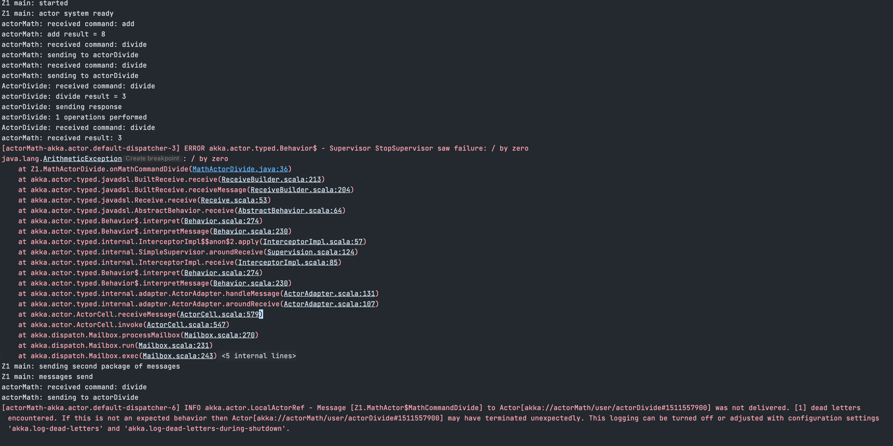

# Laboratorium 4 - Akka
> Patryk Wojtyczek, 305454

## Zadanie 1 
Zadanie polegało na obserwacji jak działają różne strategie superivsorów.

Na początku warto zaznaczyć, że strategie mają znacznie tylko gdy w przypadku gdy aktor popełnia błędy - rzuca wyjątki. W przypadku tzw. happy case wszysytkie strategie mają taki sam wpływ na program - czyli żaden.

Do testowania wykonuję następujące komendy:

### Porównanie strategii 

- stop -
  Aktor wykonuje pierwsze dzielenie, zwiększa licznik, zaczyna wykonywać drugie, zwiększa licznik,
  rzuca exception, które dostaje jako wiadomość supervisor i decyduje się ubić aktora
  strategią Stop. Przy następnej komendzie widać kolejne exception, które mówi, że wiadomość
  nie została wysłana bo aktor leży.
  
  Tak więc, strategia stop w przypadku błędu zatrzymuje na stałe aktora, który rzucił wyjątek.
  
  
  
- resume -
  Aktor wykonuje pierwsze dzielenie, zwiększa licznik, zaczyna wykonywać drugie, zwiększa licznik,
  rzuca exception, które dostaje jako wiadomość supervisor i ten decyduje się  
  wznowić aktora strategią 'Resume'. Strategia ta nie restartuje aktora ale zachowuje jego aktualny stan
  co widać bo licznik po wykonaniu następnego dzielnia wynosi 3 (1 poprawne, 1 przed exception i akutalne).
  Strategia ta nie rusza też dzieci dla których dany aktor jest supervisorem.
  
  
  
- restart - 
  Analogicznie do poprzedniej jednak teraz, stan (czyli licznik) nie został zachowany bo aktor został zrestartowany.
  Strategia ta zrestartowałaby też wszystkie dzieci dla których ten aktor byłby supervisorem.
  
  
  
## Zadanie 2

To prosty przykład, że akka może działać na wielu jvmach jednocześnie - niekoniecznie na jednym
nodzie.

- podpunkt a, output wypisany przed Z2_Main
  
  
  
- podpunkt b
  - node a - tworzy workerów, a następnie obsługuje wiadomość wysłaną z nodea b.
    
    
  - node b - tworzy serwis, który wykorzystując mechanizm recepcjonisty dostaje referencje do workerów, które
    są na nodzie a i po odpowiednio dlugiej przerwie wysyła do nich requesta: `hello`.
    
    

